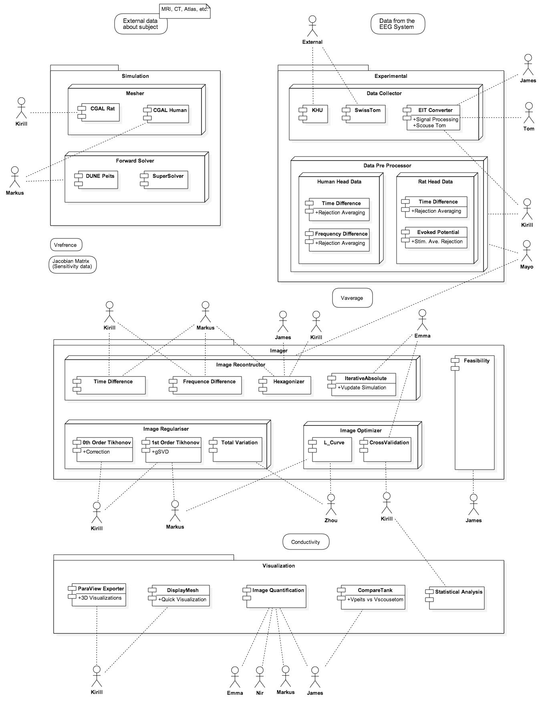

#RSDT and EITT collaboration – Work plan and Progress report

At the beginning of February 2015, a member of UCL’s RSD team started collaborating with the EIT team and will be working on their software system on a 2 days/week basis. 

The EIT team has kindly prepared a shared folder for the RSD team containing an updated version of the different subsystems and their source code. The overview workflow of the EIT Software System is represented in the following sequence diagram:

---

The following diagram represents an overview of all the components of the system, their interfaces and their authorship/management:

 

---

RSDT has examined the code and come up with a management plan for EIT’s software system:

###Version Control

At the moment, there are different versions of the code, which are customizations of specific pieces of software depending on application. It would be very beneficial for the team to have a unique version of the software they can access and contribute to, keeping track of past releases. Thus, each member of the EIT team can develop new features or correct bugs in different branches that will then be submitted for other colleague to code review before merging with the main branch.
 
The RSD team will provide training and guidance on how to version control the existing code using Git. At the beginning of March there will be hands-on training sessions on how to use Git followed by individual assessments for each member on how to version control the software they are managing. Most of RSDT effort to accomplish this task is expected to be spent in the first weeks of the collaboration while the EIT team members are learning and practising. RSDT will mentor them during the time of the collaboration to ensure this software management plan is adopted successfully.

###Automatic Testing

In the shared folder prepared by the EIT team, some of the components contain example data and source code fragments intended for testing purposes. However there is not a homogeneous automated procedure, and the testing currently in place may not be effective enough. 

The RSD team will mentor and assist in the creation of unit tests for subroutines of the code and regression tests of different functionalities to ensure the overall behavior of the EIT software system remains consistent. These tests will be managed by RSDT’s continuous integration service called Jenkins, with tests running automatically whenever code is uploaded to the Git repository, notifying developers upon failure. 

Time spent on this task depends on each of the team members’ ability to design and implement tests with RSDT’s guidance. Integration in Jenkins will be done by RSDT and checked and maintained by both. This will be a time consuming task for RSDT that will be performed gradually as the code is being refactored.

###Refactoring
This might be the most time-consuming and challenging task for RSDT. 
It’s difficult to come up with a time estimate without more information. The code has been reviewed, but needs to be examined in more detail in conjunction with the source code authors in order to give a good estimate. 
Refactoring includes:

* *Code  structure*:
The existing software has been created by different authors who have followed different programming methodologies. This is reflected in the heterogeneous structure of each of the system components. In the current version of the EIT software system, there is often duplication of code. For example, the CGAL mesher code for a human’s brain and a rat’s brain. Both pieces of software share most of the code, and their workflows are similar, so they need to be merged, made more modular and be parametized. This would improve readability and would make the code easier to test and debug. 

* *Coding conventions*:
indentation, variable naming, “magic numbers”, 

* *Adoption of other good practises*:
use a logging system instead of screen printouts, replace C++ structs with classes

###Documentation

There is existing documentation prepared by the EIT team in the form of README text files for each component and a few installation manuals and publications detailing the functioning of systems like the Forward Solver. Most of the code has comments on it, but they don’t follow the appropriate structure for an automated documentation tool like Doxygen to generate consistent documentation. Thus, it would be beneficial for the EIT team to adopt this technique for future software development and replace the existing code-embedded documentation with a Matlab/C++ documentation style appropriate for this purpose.
###Cross-platform Software Release
Some of the components in the EIT Software System work only in Windows or only in Linux. The EIT team has indicated that components like the Mesher that can only be executed in their Windows machines at the moment, would benefit from more RAM available in their Linux stations. It would also be convenient for external teams who use EIT’s software to have the choice to build the components they use in Linux or Windows.

###Collaboration with Third Parties

###Summary


