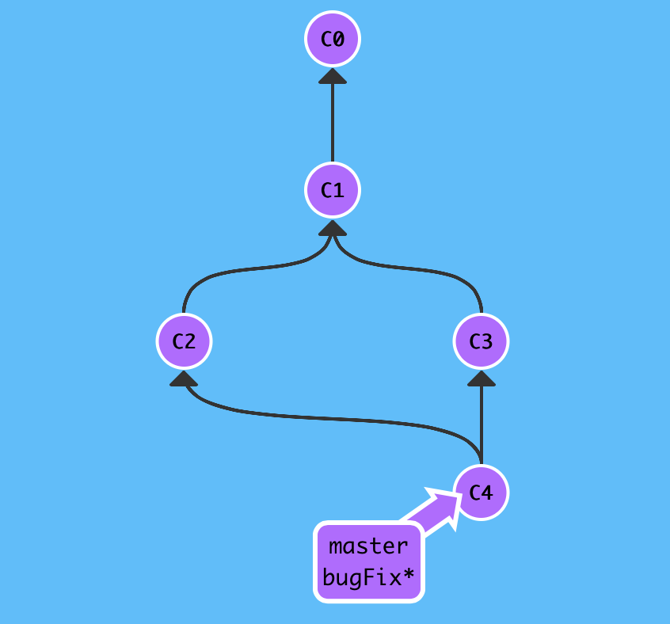
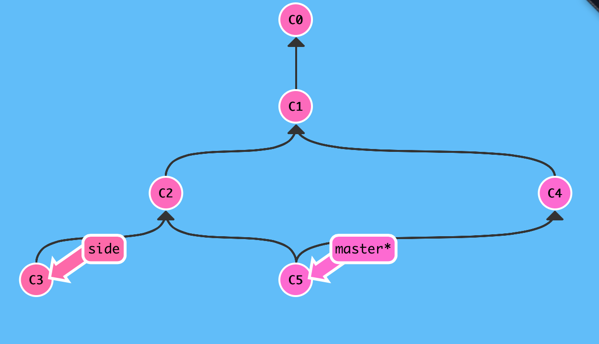

**A1. Confirm correct installation of:**

 * Git
 * Smartgit
 * GitHub accounts


**A2. Create ~/workspace/git_training/my\_profile**

```bash
mkdir -p ~/workspace/git_training/my_profile
cd ~/workspace/git_training/my_profile
```

Just ME: split vertically screen and do:

```bash
while :
do
	clear
	tree -a
	sleep 1
done
```

**A3. Create some files:**

```bash
touch colours.txt numbers.txt pets.txt planets.txt
echo "My favourite colour is red." > colours.txt 
echo "I don't like number 13." > numbers.txt
echo "I once had a dog, but then I became allergic." > pets.txt
echo "I'd like to travel to Mars sometime." > planets.txt 
tree -a
```

**A4. Start git, add, configure and commit:**

```bash
git init
```
ME: Show tree -a

```bash
git status
git add colours.txt
git status
```

ME: Show tree -a and slides - what else to do now?

```bash
git commit -m "This is my first commit message. How very exciting." colours.txt
```
Solve configuration issues...

```bash
tree -L 1 ~/
git config --global user.email "r.alegre@ucl.ac.uk"
tree -L 1 ~/
cat ~/.gitconfig
git config --global user.name "raquel-test"
cat ~/.gitconfig
```

**Commit stuff:**

```bash
git commit -m "This is my first commit message. How very exciting." colours.txt
git status
git log
```

**A5. Change colours.txt**

```bash
vim colours.txt (change red to blue)
git status
git diff colours.txt
git commit -m "Changed my mind." colours.txt
git status
git log
```

**A6. Change colours.txt again!**

```bash
vim colours.txt (change blue to green)
git status
git diff colours.txt
git log
git diff <hash first commit> colours.txt
git diff HEAD~ colours.txt
git diff HEAD~1 colours.txt
git diff HEAD~2 colours.txt
git diff HEAD~3 colours.txt
```

Note we are just dealing with a single simple file, think about the possibilities when needing this kind of utility for bigger real projects.

**A7. Do other stuff with the rest of the files**

```bash
git add pets.txt
git commit -m "Some information on my animal friends." pets.txt
git add numbers.txt
git status
```

**A8. Open smartgit**
Choose non-commercial version and add GitHub details.
Configure my_profile as a repository.
Show status of repository matching output of "git status" (status, diffs, log)
Right click - commit colours, add untracked, commit untracked

```bash
git status
git log
```
They match!

**A9. Put things on GitHub**
Log in, create new repo called my_profile, choose "push an existing repository from command line", check push worked.
Clone repo somewhere else:

```bash
mkdir ~/workspace/git_training/testing_my_profile
cd ~/workspace/git_training/testing_my_profile
git clone <my_profile.git repo>
tree -a 
```
Show other things to be done with GitHub: groups, issue tracking, etc.
Give link to Holder's project.

**A10. Undoing things**
We have assumed that we'll always type the correct commit messages, and we will never make mistakes in our commited or staged files. Truth is that is not so much the case! Undoing mistakes is often necessary.

Be careful, because you can’t always undo some of these undos. This is one of the few areas in Git where you may lose some work if you do it wrong.

**_Oh no! I didn't want to stage that file!_**

```bash
touch family.txt
echo "I have a sister. She lives in pain." > family.txt
git status
git add . 
git status (gives me suggestions)
git reset HEAD family.txt
git status
echo "I have a sister. She lives in Spain." > family.txt
git add .
git commit -m "More background information about me added." 
git status
```

**_Oh no! I didn't mean to modify that file!_**

```bash
cat colours.txt
echo "Looks like I'm incorrectly overwritting this file" > colours.txt
cat colours.txt
git status (suggests what to do!)
git checkout -- colours.txt
cat colours.txt
git status
```

Phew!


**A11. Ignore stuff**
Not everything needs to be version controlled. For example: autorecovery files created by editors (e.g. colours.txt~), outputs from executing a source code, object files (e.g. *.o), etc. In this case, we need to tell git not to keep track of them using gitignore:

```bash
touch colours.txt~ pets.txt~
git status
```

If we do 
```
"git add ."
```
in the current folder, those autorecovery files would get in the staging area and committed later on, which we are trying to avoid. In order to do that, see:

```bash
cat .git/info/exclude
```

This is an example gitignore file. We'll need to create one in the folder where the files to be ignored are.

```bash
touch .gitignore
echo "*~" > .gitignore
git status
```

The autorecovery files should have dissapeared from the list of untracked files. If we do
```
"git add ."
```
now, they won't be picked up by git.

However, things still look strange when we look in the list of untracked files. Should ".gitignore" be there? In this case it might not be a good idea, so we'll ignore it too.

```bash
echo ".gitignore" >> .gitignore
cat .gitignore
git status
```

You can also easily ignore files with smartgit.

**A12. Exercise:**

 * Choose a subset of your source code (or some other colleague's code). A few *.m, *.cpp, *.h files will suffice. They MUST be light weight files, not enormous Jacobian matrices :) They can be all together in a single folder, or preferably distributed in different folders. Output files that can be generated with the existent code like "\*.o" files, must be ignored. 
 
 * Go to GitHub and create a new repository with a sensitive name.
 
 * Choose the first option "Create new repository on the command line" and follow instructions one by one, trying to understand what you are doing. Your repository will be cloned in some local folder. Suggestion: create a new folder to  clone this code in ~/workspace/git_training.
 
 * The cloned repository should be empty. Add the source code files and folder you consider to this empty repository.
 
 * Use the git commands you have learned to upload your work to GitHub, make changes to it, revert them, check the log, play with Smartgit, ...
 
 
 ----------
 ----------


**Commit review**

When we commit a change, we are just adding a new commit node to our repository (directed graph).


Exercise:


Solution:

```bash
git commit
git commit
```


**Branching**

Branches are simply references to a specific commit -- nothing more
it's easier to logically divide up your work than have big beefy branches.
When we start mixing branches and commits, we will see how these two features combine. For now though, just remember that a branch essentially says "I want to include the work of this commit and all parent commits."

```bash
git branch newImage
```


There, that's all there is to branching! The branch newImage now refers to commit C1

```bash
git commit
```


Oh no! The master branch moved but the newImage branch didn't! That's because we weren't "on" the new branch, which is why the asterisk (*) was on master


Let's tell git we want to checkout the branch with

```bash
git checkout [name]
```

This will put us on the new branch before committing our changes

```bash
git checkout newImage
git commit
```


Exercise: Create a new branch called "bugFix" and move to that branch.


Solution 1:
 
```bash
git branch bugFix
git checkout bugFix
```

Solution 2: 

```bash
git checkout -b bugFix
```


Back to our real-life terminal:

```
mkdir ~/workspace/git_training/branching
cd ~/workspace/git_training/branching
```

(show .git content)

```
while :
 do 
 clear; 
 tree .git; 
 sleep 1; 
done
```

First thing to do?

```
git init
```

Make up some stuff to play with:

```
touch helloBranches.txt
git status
git add .
git status
git commit -m "some random commit message." 
git status
```

Branch info:


```
git branch (see output, asterisk, and content of .git)
```

Create new branch:

```
git newBranch
```


```
git branch
```


```
git checkout master
git branch
git checkout newBranch
git branch
git checkout -b anotherBranch
git branch
```


```
git init
git add .
git commit -m "some new empty files"
git branch
git branch newBranch
git branch
echo "Hello Mayo" > a.txt
echo "Hello Tom" > a.txt
git add a.txt
git commit -m "saying hello to people"
git log
git checkout newBranch
git branch
git log
```

Why are logs different?
Make diffs, move around branches and print out file content.


**Merging**

Great! We now know how to commit and branch. Now we need to learn some kind of way of combining the work from two different branches together. This will allow us to branch off, develop a new feature, and then combine it back in.

The first method to combine work that we will examine is git merge. Merging in Git creates a special commit that has two unique parents. A commit with two parents essentially means "I want to include all the work from this parent over here and this one over here, and the set of all their parents."


Here we have two branches; each has one commit that's unique. This means that neither branch includes the entire set of "work" in the repository that we have done. Let's fix that with merge.

We will merge the branch bugFix into master

```bash
git merge bugFix
```


Woah! See that? First of all, master now points to a commit that has two parents. If you follow the arrows up the commit tree from master, you will hit every commit along the way to the root. This means that master contains all the work in the repository now.


```bash
git checkout bugFix
git merge master
```



Since bugFix was an ancestor of master, git didn't have to do any work; it simply just moved bugFix to the same commit master was attached to.


Exercise:

```
Create a new branch bugFix. 
Commit to bugFix
Commit to master
Merge bugFix into master
```


Solution:

```bash
git checkout -b bugFix
git commit
git checkout master
git commit
git merge bugFix
```


**Referencing**

Moving around in Git by specifying commit hashes can get a bit tedious. In the real world you won't have a nice commit tree visualization next to your terminal, so you'll have to use git log to see hashes.

Furthermore, hashes are usually a lot longer in the real Git world as well. For instance, the hash of the commit that introduced the previous level is fed2da64c0efc5293610bdd892f82a58e8cbc5d8. 

The upside is that Git is smart about hashes. It only requires you to specify enough characters of the hash until it uniquely identifies the commit. So I can type fed2 instead of the long string above.

Like I said, specifying commits by their hash isn't the most convenient thing ever, which is why Git has **relative refs**.

With relative refs, you can start somewhere memorable (like the branch bugFix or HEAD) and work from there.

Relative commits are powerful, but we will introduce two simple ones here:

```
Moving upwards one commit at a time with ^
Moving upwards a number of times with ~<num>
```

Let's look at the Caret (^) operator first. Each time you append that to a ref name, you are telling Git to find the parent of the specified commit.

So saying ```master^``` is equivalent to "the first parent of master".

```master^^``` is the grandparent (second-generation ancestor) of ```master```.

Let's check out the commit above master here

```
git checkout master^
```


You can also reference HEAD as a relative ref. Let's use that a couple of times to move upwards in the commit tree

```
git checkout C3
git checkout HEAD^
git checkout HEAD^
git checkout HEAD^
```


Say you want to move a lot of levels up in the commit tree. It might be tedious to type ^ several times, so Git also has the tilde (~) operator.

The tilde operator (optionally) takes in a trailing number that specifies the number of parents you would like to ascend. Let's see it in action

```
git checkout HEAD~4
```


One of the most common ways I use relative refs is to move branches around. You can directly reassign a branch to a commit with the -f option. So something like:

```
git branch -f master HEAD~3
```

Moves (by force) the master branch to three parents behind HEAD.


Exercise:

```
Move references to match the goals in pink.
```


Solution:

```  
git checkout bugFix    
git checkout HEAD^
```


Solution:

```  
git branch -f master C6    
git checkout HEAD~1    
git branch -f bugFix HEAD~1
```


**Undo**

There are two primary ways to undo changes in Git -- one is using ```git reset``` and the other is using ```git revert```. 

```git reset``` reverts changes by moving a branch reference backwards in time to an older commit. In this sense you can think of it as "rewriting history;" 

```git reset``` will move a branch backwards as if the commit had never been made in the first place.

Let's see what that looks like:

```
git reset HEAD~1
```


Git simply moved the master branch reference back to C1; now our local. 

While reseting works great for local branches on your own machine, its method of "rewriting history" doesn't work for remote branches that others are using.

In order to reverse changes and share those reversed changes with others, we need to use ```git revert```. Let's see it in action

```
git revert HEAD
```


Weird, a new commit plopped down below the commit we wanted to reverse. That's because this new commit ```C2'``` introduces changes -- it just happens to introduce changes that exactly reverses the commit of ```C2```.

With reverting, you can push out your changes to share with others.

Exercise:

```
Reverse last two commits.
```


Solution:

```
git reset HEAD~1    
git checkout pushed    
git revert HEAD
```


**Cherry-pick**

It takes on the following form:

```
git cherry-pick <Commit1> <Commit2> <...>
```

It's a very straightforward way of saying that you would like to copy a series of commits below your current location (HEAD). 

Here's a repository where we have some work in branch side that we want to copy to master. 

```
git cherry-pick C2 C4
```


 
 
Exercise: 
```
Copy some work from the three branches shown into master. 
```


Solution:

```
git cherry-pick C3 C4 C7  
```


Exercise:

```
Here's a development situation that often happens: I'm trying to track down a bug but it is quite elusive. In order to aid in my detective work, I put in a few debug commands and a few print statements.

All of these debugging / print statements are in their own commits. Finally I track down the bug, fix it, and rejoice!

Only problem is that I now need to get my bugFix back into the master branch. If I simply fast-forwarded master, then master would get all my debug statements which is undesirable. There has to be another way...
```


Solution

```
git checkout master    
git cherry-pick C4
```

**Tags**

Branches are easy to move around and often refer to different commits as work is completed on them. Branches are easily mutated, often temporary, and always changing.

If that's the case, you may be wondering if there's a way to permanently mark historical points in your project's history. For things like major releases and big merges, there is a way to mark them with something more permanent than a branch: tags. They (somewhat) permanently mark certain commits as "milestones" that you can then reference like a branch.

More importantly though, they never move as more commits are created. You can't "check out" a tag and then complete work on that tag -- tags exist as anchors in the commit tree that designate certain spots.

Let's try making a tag at C1 which is our version 1 prototype:

```
git tag v1 C1
```


We named the tag v1 and referenced the commit C1 explicitly. If you leave the commit off, git will just use whatever HEAD is at.

Exercise:

```
Create the tags in the goal visualization and then check v1 out. 
```




Solution:

```
git tag v1 side~1    
git tag v0 master~2    
git checkout v1	
```

**Git Describe**

Because tags serve as such great "anchors" in the codebase, git has a command to describe where you are relative to the closest "anchor" (aka tag). And that command is called git describe!

Git describe can help you get your bearings after you've moved many commits backwards or forwards in history; this can happen after you've completed a git bisect (a debugging search) or when sitting down at a coworkers computer who just got back from vacation.

Git describe takes the form of:

git describe <ref>

Where <ref> is anything git can resolve into a commit. If you don't specify a ref, git just uses where you're checked out right now (HEAD).

The output of the command looks like:

<tag>_<numCommits>_g<hash>

Where tag is the closest ancestor tag in history, numCommits is how many commits away that tag is, and <hash> is the hash of the commit being described.

The command git describe master would output:

v1\_2\_gC2

Whereas git describe side would output:

v2\_1\_gC4


